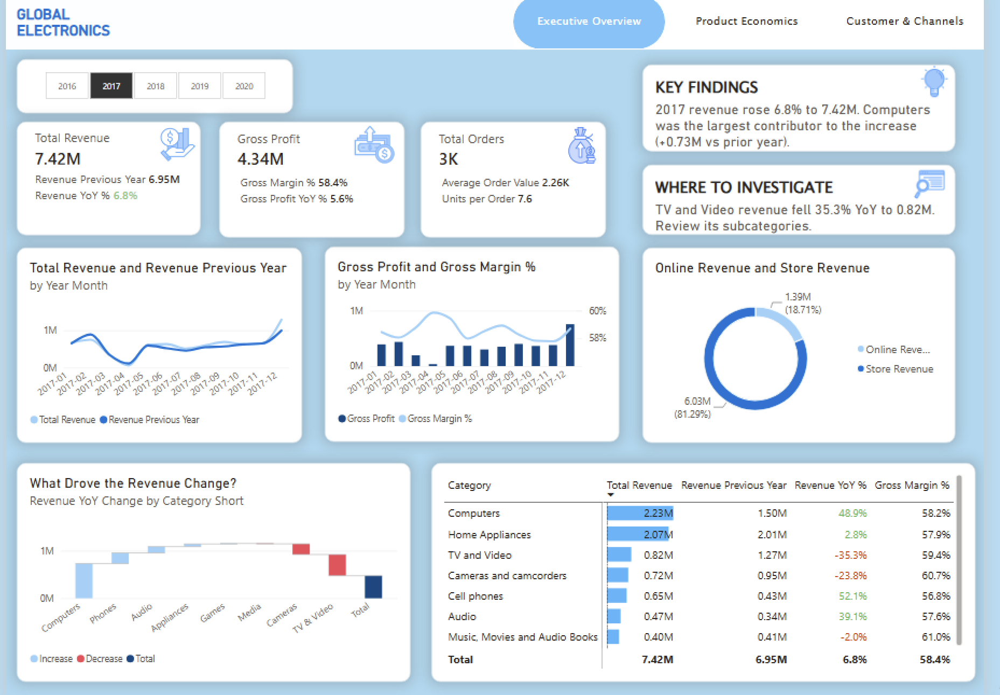
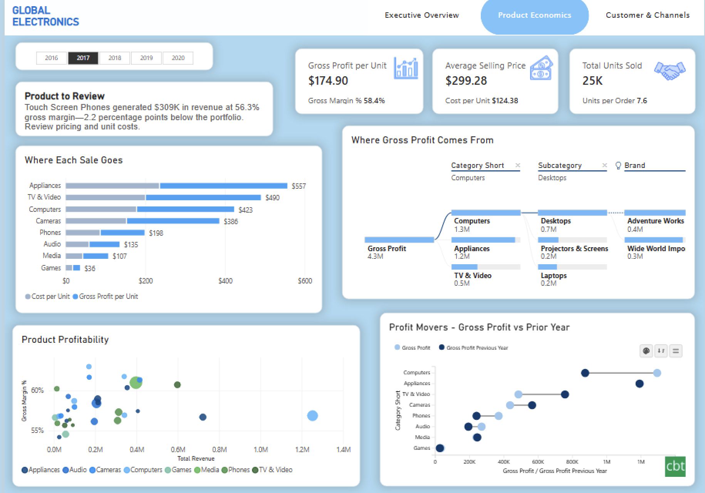
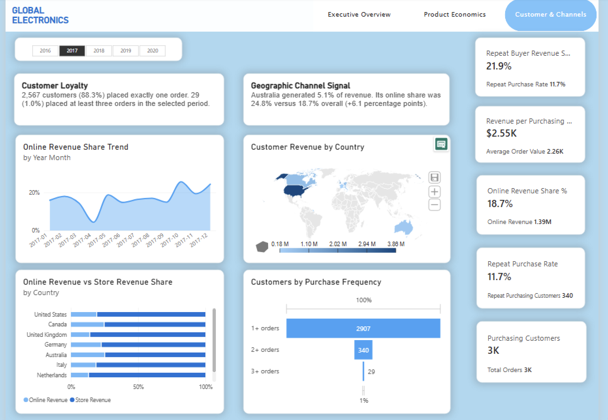

# Global Electronics | Sales & Profitability Analytics

A three-page Power BI report connecting executive performance, product economics, and customer behavior for a fictitious global electronics retailer. The report combines performance monitoring with contribution analysis and dynamic findings to identify where further investigation would be useful.

**Tools:** Power BI Desktop, Power Query, DAX, and relational data modeling.  
**Scope:** 62,884 sales line items, January 2016 to February 2021.  
**Author:** [Aman](https://github.com/AmanZayn7)

[Download the report](global%20electronics.pbix) | [Source dataset](https://mavenanalytics.io/data-playground/global-electronics-retailer)

> Sales records end on February 20, 2021. The dataset contains all 12 months for 2016-2020, but 2021 is incomplete.

## Contents

- [Dashboard previews](#dashboard-previews)
- [Business questions](#business-questions)
- [Business insights and findings](#business-insights-and-findings)
- [Technical implementation](#technical-implementation)
- [Metric definitions and interpretation](#metric-definitions-and-interpretation)
- [Explore the report](#explore-the-report)

## Dashboard Previews

### Executive Overview



<details>
<summary><strong>View Product Economics</strong></summary>



</details>

<details>
<summary><strong>View Customer & Channels</strong></summary>



</details>

## Business Questions

| Page | Questions answered | Analytical approach |
| --- | --- | --- |
| **Executive Overview** | How are revenue, profit, and orders performing? Which categories explain the change? | KPI comparisons, monthly trends, channel mix, category waterfall, and a supporting matrix. |
| **Product Economics** | How much gross profit does each unit generate? Which products combine scale with margin quality? Where is profit concentrated? | Unit-economics breakdown, profitability scatter, profit decomposition, and a prior-year dumbbell comparison. |
| **Customer & Channels** | How frequently do customers purchase? How does online share vary over time and across countries? | Customer KPIs, online-share trend, customer geography, country-level channel mix, and purchase-frequency analysis. |

## Business Insights and Findings

The findings below refer to specific years and filter contexts. They demonstrate how the report supports investigation; proposed actions are recommendations for further analysis, not measured business outcomes.

### 1. The 2020 Revenue Decline Was Primarily Volume-Driven

Revenue fell **49.1%**, from **$18.26M in 2019 to $9.29M in 2020**. The number of distinct orders fell at almost the same rate, while average order value changed very little.

| Metric | 2019 | 2020 | Change |
| --- | ---: | ---: | ---: |
| Revenue | $18.26M | $9.29M | -49.1% |
| Distinct orders | 9,083 | 4,635 | Approximately -49.0% |
| Units sold | 68,440 | 34,463 | Approximately -49.6% |
| Average order value | $2,010.83 | $2,005.31 | Approximately -0.3% |

**Interpretation:** The business processed fewer orders and sold fewer units. Customers who did place orders spent nearly the same amount per transaction. This makes lower purchasing volume the main arithmetic explanation for the revenue decline.

**Where to investigate:** Break the order decline down by month, category, country, and channel. Distinguish fewer purchasing customers from fewer orders per customer before recommending an acquisition or repeat-purchase initiative.

**Boundary:** The dataset does not prove why demand fell. Explanations such as the pandemic, stock availability, or changes in marketing require additional evidence.

### 2. Positive Overall Growth Concealed Category Weakness

In **2017**, total revenue increased **6.8% to $7.42M**. Computers contributed approximately **$0.73M** in additional revenue, while TV & Video revenue fell **35.3% to approximately $0.82M**.

**Interpretation:** Growth was uneven. The gain in Computers offset weakness elsewhere, so the positive headline alone would have understated category-level risk. Absolute revenue contribution and percentage growth answer different questions: a large category can drive the result even when a smaller category has a higher growth rate.

**Where to investigate:** Use the revenue waterfall to identify the largest positive and negative contributions, then compare their revenue scale and margins in the matrix. Drill into the weaker categories to determine whether declines are concentrated in particular subcategories or brands.

### 3. Meaningful Revenue Does Not Automatically Indicate Strong Margin Quality

The **2017 Product to Review** narrative highlighted Touch Screen Phones: approximately **$309K in revenue at a 56.3% gross margin**, around **2.2 percentage points below the portfolio benchmark**.

The page also shows the overall unit economics for that selection:

| Metric | 2017 value |
| --- | ---: |
| Average selling price | $299.28 per unit |
| Cost per unit | $124.38 per unit |
| Gross profit per unit | $174.90 per unit |

**Interpretation:** Selling price alone does not describe profitability. The relationship between selling price and unit cost determines how much gross profit remains. A product below the portfolio margin may still be profitable and commercially important; it is a candidate for review rather than an automatic removal decision.

**Where to investigate:** Compare pricing, unit costs, brand mix, and product-level volume. Use the scatter plot to assess revenue scale alongside margin, and the decomposition tree to locate profit concentration. Any price or assortment change would need demand and competitive evidence beyond this dataset.

### 4. Purchasing Customers Were Concentrated in One-Order Buyers

In **2017**, the report identified **2,907 purchasing customers**. Of these, **2,567 (88.3%)** placed exactly one order, **340 (11.7%)** placed at least two, and **29 (1.0%)** placed at least three.

**Interpretation:** Most customers contributed through a single order in the selected year. This supports closer analysis of repeat-purchase behavior, but electronics can have long replacement cycles, so one order is not automatically evidence of dissatisfaction or churn.

**Where to investigate:** Compare repeat purchasing across categories, countries, and channels. Separate first-time buyers from established customers and consider category-specific purchase cycles before proposing follow-up campaigns or cross-selling.

**Boundary:** The purchase-frequency groups are cumulative. The 3+ group is contained within 2+, which is contained within 1+; these are not separate populations to add together.

### 5. Country-Level Channel Mix Revealed Differences Hidden by the Overall Share

In **2017**, online sales accounted for approximately **18.7% of total revenue**. Australia generated approximately **5.1% of revenue**, with an online share of **24.8%**, approximately **6.1 percentage points above the overall share**.

**Interpretation:** A country's revenue size and its channel mix are separate dimensions. A smaller revenue market can have a stronger online mix than the portfolio, while a larger market may remain predominantly store-based.

**Where to investigate:** Assess countries using both revenue scale and online share. Compare customer reach, revenue per customer, and repeat purchasing to understand whether a higher online share reflects a broader customer base or a concentrated group of buyers.

**Boundary:** A higher online share is a descriptive signal, not proof of greater channel profitability or unmet online demand.

## Technical Implementation

### 1. Power Query: Cleaning and Data Preparation

The preparation stage converted the source CSV tables into usable inputs for financial measures and date-based analysis.

| Preparation task | Implementation | Why it matters |
| --- | --- | --- |
| Currency-text cleaning | Removed currency symbols and thousands separators from product unit-price and unit-cost fields before converting them to decimal numbers. | Enables arithmetic on numeric values rather than formatted text. |
| Date normalization | Assigned date types to order dates, delivery dates, customer birthdays, store opening dates, and exchange-rate dates. | Supports consistent date interpretation and calendar-based analysis. |
| Query organization | Used fact/dimension naming to distinguish sales transactions from descriptive tables. | Makes table roles and measure dependencies easier to follow. |
| Multi-table preparation | Prepared sales, product, customer, store, and exchange-rate sources separately. | Preserves each table's grain and avoids conflating descriptive records with sales transactions. |

Blank source fields, such as missing delivery dates, should not be interpreted as zero-day delivery. Exchange rates are part of the source package; the report's monetary calculations use the supplied USD product prices and costs rather than claiming an exchange-rate conversion workflow.

### 2. Data Modeling and Calendar Design

The model centers on **`factSales`**, with active relationships to product, customer, store, and calendar tables. Customer, product, and store keys connect the corresponding attributes to sales analysis.

**Grain:** A row in `factSales` is an order line. An order containing multiple products can therefore appear on multiple rows. Distinct order counts are necessary for order KPIs and average order value.

**Calendar:** A dedicated `dimDate` was created using a DAX calendar construction with `CALENDAR` and `ADDCOLUMNS`, based on the sales date range. It provides the year and month context for slicers, monthly trends, and prior-year comparisons.

**Separation of concerns:** Source preparation handles types and source structure; model relationships support filtering; reusable measures own the business calculations. The same measures can therefore be used across KPI cards, charts, matrices, and narratives.

### 3. DAX: Advanced Analytical and Presentation Logic

This section focuses on the report's more involved DAX applications: customer-level threshold evaluation, purchase-frequency staging, dynamic narrative construction, portfolio benchmarking, and the fields that support compact visual labels.

#### Purchase-Frequency Funnel Staging and Context Transition

The funnel groups customers by the number of **distinct orders within the current filter context**. It evaluates customers individually rather than grouping sales rows by their number of line items.

| Funnel stage | Qualification | Relationship to other stages |
| --- | --- | --- |
| **1+ orders** | Customer placed at least one distinct order. | Base purchasing-customer population. |
| **2+ orders** | Customer placed at least two distinct orders. | Subset of 1+; repeat purchasing customers. |
| **3+ orders** | Customer placed at least three distinct orders. | Subset of 2+; higher-frequency purchasing customers. |

The underlying calculation must distinguish three things: the customer set, each customer's distinct order count, and the threshold used by the displayed stage. The year and other report filters constrain the population before qualification.

<details>
<summary><strong>View the implemented customer-threshold DAX</strong></summary>

```dax
Repeat Purchasing Customers =
COUNTROWS(
    FILTER(
        VALUES(factSales[CustomerKey]),
        CALCULATE(
            DISTINCTCOUNT(factSales[Order Number])
        ) >= 2
    )
)
```

**Evaluation sequence:**

1. `VALUES` produces the distinct customer set in the selected context.
2. `FILTER` iterates that set and evaluates each customer's eligibility.
3. `CALCULATE` converts the current customer row context into filter context.
4. `DISTINCTCOUNT` counts that customer's orders, not individual product lines.
5. `COUNTROWS` counts customers who meet the threshold.

The same customer-level qualification principle underpins the cumulative 1+, 2+, and 3+ stages. Exactly-one-order buyers form a different, non-cumulative group used in the Customer Loyalty narrative.

</details>

**Why this is more involved than a simple count:** Customer eligibility depends on an aggregation evaluated separately for each customer under active filters. A multi-item order must count as one purchase; selecting a different year must recompute eligibility. Because the groups overlap, the stages cannot be summed or interpreted as sequential conversion steps.

#### Dynamic Descriptive Text: Entity Selection, Evaluation, and Narrative Assembly

The descriptive text boxes are powered by DAX measures. They combine the relevant entity, its contextual values, a comparison, and a readable interpretation into text that updates when the selected year changes.

| Narrative | Evaluation and selection logic | Text communicated |
| --- | --- | --- |
| **Key Findings** | Evaluates selected-period revenue and YoY movement, then identifies the category contributing most to the change. | Revenue level, growth/decline direction, and the main category contribution. |
| **Where to Investigate** | Evaluates category weakness alongside current revenue and prior-year movement. | The category to review, the scale of its decline, and a focused investigation prompt. |
| **Product to Review** | Evaluates a product/subcategory's revenue and margin against the portfolio benchmark to surface a review candidate. | Product name, revenue, gross margin, and the gap below the benchmark. |
| **Customer Loyalty** | Combines exactly-one-order customer counts with cumulative higher-frequency counts and their shares. | The concentration of one-order buyers and the size of the higher-frequency group. |
| **Geographic Channel Signal** | Evaluates country revenue share and compares country-level online share with the overall share. | Country name, its contribution to revenue, and its channel-mix difference. |

**Narrative construction:** The measure evaluates the selected context, obtains the relevant entity and values, expresses the comparison in appropriate units, and assembles the result into a sentence. Formatting values for narrative text is separate from keeping the underlying measures numeric for charts and calculations.

For example, the Product to Review text combines a subcategory name, revenue in K/M, gross margin as a percentage, and a **percentage-point** gap. The Geographic Channel Signal similarly combines country revenue share and an online-share gap. These are multi-component analytical statements rather than static captions.

#### Portfolio Benchmarking in the Product Narrative

The Product to Review narrative compares two scopes: the selected product/subcategory and the relevant portfolio benchmark.

The product's margin is meaningful only alongside its revenue scale and the broader margin reference. The measure then communicates the gap in **percentage points**, preserving the distinction between a margin difference and a percentage change in margin.

**Example from the report:** Touch Screen Phones generated approximately $309K in 2017 revenue at a 56.3% gross margin, around 2.2 percentage points below the portfolio. The narrative pairs this result with a pricing and cost review prompt without treating the gap as proven recoverable profit.

This application involves entity-level evaluation, a broader comparison scope, and contextual text presentation. It requires more care than showing a margin value in isolation.

#### DAX-Supported Axis, Legend, and Card Labels

The report also uses a presentation layer to make analytical results fit compact visuals.

| Application | Implementation role | Analytical benefit |
| --- | --- | --- |
| **Short category labels** | The derived `Category Short` field maps long category names to concise display labels such as Appliances, Phones, Cameras, and Media. | Reduces crowding on waterfall axes, chart legends, and category comparisons. |
| **Narrative number labels** | Descriptive measures embed currency, K/M values, percentages, and percentage-point gaps into readable text. | Keeps the interpretation understandable without requiring a separate lookup of every metric. |
| **KPI supporting labels** | Cards pair the headline measure with contextual comparisons or supporting measures. | Adds context within the same container while maintaining a consistent hierarchy. |
| **Conditional presentation** | Positive/negative comparisons are formatted according to their numeric results. | Keeps the visual indication aligned with the selected year's result. |

**Important distinction:** `Category Short` is a categorical display field, not a financial measure. It changes how a category is shown, not the business meaning of the category. Conditional color and numeric display settings are presentation features; the advanced analytical work is in the measures and comparisons they communicate.

The full source categories remain meaningful for analysis. Narrative strings support descriptive text; underlying numeric measures continue to drive axes, sorting, chart values, and comparisons.

### 4. Visual Design and Analytical Interaction

Visuals were chosen for different analytical tasks, not simply to increase the number of chart types.

| Visual | Purpose | Design consideration |
| --- | --- | --- |
| **Revenue line chart** | Compare current and prior-year monthly performance. | Both revenue series share a common scale to avoid misleading comparisons. |
| **Profit/margin combination chart** | Compare gross-profit dollars with the margin rate. | Separate units are identified because dollars and percentages have different meanings. |
| **Revenue waterfall** | Explain category contributions to the net change. | Gains and losses use distinct colors; values represent changes, not category revenue totals. |
| **Profitability bubble chart** | Evaluate revenue scale, margin, and gross-profit magnitude together. | X = revenue; Y = gross margin; bubble size = gross profit, with category grouping. |
| **Decomposition tree** | Explore gross profit through category, subcategory, and brand. | Supports interactive contribution exploration rather than a fixed hierarchy screenshot alone. |
| **Dumbbell chart** | Compare current and prior-year gross profit by category. | Connected endpoints emphasize the size and direction of the difference. |
| **Unit-economics stacked bar** | Show how selling price divides into cost and gross profit per unit. | Cost per unit plus gross profit per unit equals average selling price. |
| **Country map and channel bars** | Show geographic customer revenue and country-specific channel mix. | Country revenue magnitude and channel share are separate questions. |
| **Purchase-frequency funnel** | Compare the counts meeting increasing order thresholds. | Groups are cumulative, not stages of a sequential conversion process. |

The report also includes page navigation, year slicers, supporting KPI metrics, conditional formatting for positive/negative comparisons, and hover information. A consistent visual system keeps titles, spacing, colors, and containers aligned across the three pages.

### 5. Validation and Analytical Checks

The project included checks that address common sources of misleading results:

- Compared reported revenue and prior-year revenue with the displayed YoY calculation.
- Checked date coverage before interpreting the 2020 decline and partial 2021 results.
- Used distinct orders for order KPIs and customer purchase-frequency calculations.
- Corrected revenue-series axis scaling so their relative positions are interpretable.
- Standardized currencies, percentages, and large-number display units across visuals.
- Distinguished ratio calculations, cumulative customer groups, and gross profit from potentially misleading interpretations.

These are analytical consistency checks, not a claim of automated test coverage or a production deployment.

## Metric Definitions and Interpretation

| Metric | Definition |
| --- | --- |
| Total Revenue | Quantity multiplied by the supplied USD unit selling price, summed across sales lines. |
| Gross Profit | Revenue less product cost. Operating expenses are not included. |
| Gross Margin % | Gross profit divided by revenue. |
| Average Selling Price | Revenue divided by units sold. |
| Gross Profit per Unit | Gross profit divided by units sold. |
| Average Order Value | Revenue divided by distinct orders. |
| Repeat Purchase Rate | Customers with at least two distinct orders divided by purchasing customers in the selected context. |
| Repeat Buyer Revenue Share | Revenue from repeat purchasing customers divided by total revenue in the selected context. |
| Online Revenue Share % | Online revenue divided by total revenue; online transactions are identified using `StoreKey = 0`. |

**Additional interpretation notes:** The customer map reflects customer location rather than necessarily store location. Gross margin is not net margin. Narrative selections and values change with filters. Full-year and partial-year results need matched-period comparisons.

## Explore the Report

1. Download [the Power BI report](global%20electronics.pbix) and open it in Power BI Desktop.
2. Use page navigation and the year slicer to explore the measures and dynamic findings.
3. Hover over visuals for supporting metrics and expand the decomposition tree to investigate gross-profit contributions.
4. To refresh the data, extract [the dataset archive](Global%2BElectronics%2BRetailer.zip) and update local source paths in Power Query as needed.

Screenshots provide static previews. The `.pbix` contains the interactive report. Custom visual rendering may vary across viewing and export environments.

## Sources and Technical References

- [Global Electronics Retailer dataset - Maven Analytics](https://mavenanalytics.io/data-playground/global-electronics-retailer)
- [CALCULATE and context transition - Microsoft Learn](https://learn.microsoft.com/en-us/dax/calculate-function-dax)

---

**Portfolio scope:** An independent analytics project demonstrating data preparation, measure design, business interpretation, and interactive reporting. Recommendations are proposed investigative actions, not claims of achieved commercial results.
